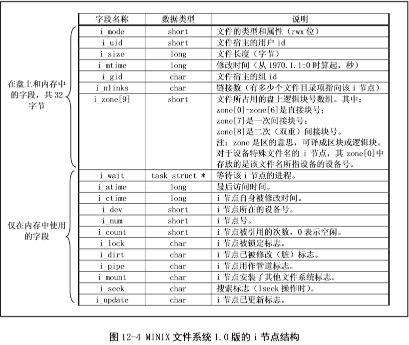

# FileManagement
# 文件管理系统实现

操作系统 课程作业 3

#### Author：欧阳桥梁 1753112

## 项目背景

1. 在内存中开辟一个空间作为文件存储器（虚拟磁盘），在其上实现一个简单的文件管理系统
2. 退出这个文件系统时，应将文件系统的内容保存在磁盘上，下次将其恢复到内存中
3. 文件目录采用多级目录结构

## 项目概述

本项目是基于MINIX1.0 的文件管理系统。主要借鉴了linux0.11的源码，参考赵炯编编著的《linux内核完全注释》。去掉了linux0.11中的多进程，内存管理等模块，目标是能够真正的操作磁盘文件。
基于c++的控制台，实现了linux的基本文件操作命令，包括ls，cd，mkdir，rm，vi等等命令，同时提供基本文件接口，包括sys_open,sys_close,sys_read,sys_write,sys_lseek等系统调用。
**/文件管理系统/hdc0.11.img** 是一个MINIX文件格式的磁盘文件，可以装载在ubuntu下，下面其在ubuntu装载的显示根目录结构。本项目所有的演示操作都是对hdc0.11.img进行的。
（hdc0.11.img存储了linux0.11的所有源码以及相关开发工具）


## 开发/运行环境

- 开发环境：Windows10 Pro 1803
- 开发语言：C++/C
- 开发工具：Microsoft Visual Studio Community 2017

## MINIX1.0文件系统

linux0.11采用的是MINIX 1.0文件系统。MINIX 1.0 文件系统与标准 UNIX 的文件系统基本相同。它由6个部分组成。对于一个360K的盘，其各部分的分布如下图所示。
( 图片来自《linux内核完全注释》)


图中，整个磁盘被划分成以1KB为单位的磁盘块，因此上图中共有360个磁盘块，每个方格表示一个磁盘块。在MIMX1.0文件系统中，其磁盘块大小与逻辑块大小正好是一样的，也是1KB字节。
因此360KB盘片也含有360个逻辑块。

### 1. 引导块

引导块是计算机加电启动时可由ROMBIOS自动读入的执行代码和数据。但并非所有盘都用于作为引导设备，所以对于不用于引导的盘片，这一盘块中可以不含代码。
但任何盘片必须含有引导块空间，以保持MIMX文件系统格式的统一。即文件系统只是在块设备上空出一个存放引导块的空间。如果你把内核映像文件放在文件系统中，
那么你就可以在文件系统所在设备的第1个块（即引导块空间）存放实际的引导程序，并由它来取得和加载文件系统中的内核映像文件（hdc-0.11.img的引导块存放的就是linux0.11的内核代码）。
由于本项目为文件系统，故并不关心引导块。

### 2. 超级块

用于描述文件系统的整体信息，并说明各部分的大小。在系统初始化时读入磁盘的超级块信息，获取磁盘的各项基本信息
包括：

1. 总/空闲inode数量
2. 总/空闲逻辑块数量
3. 第一个逻辑块位置
具体参见下图


### 3. i节点位图

记录inode表的使用情况，每一位记录一个inode是否被使用，0表示未使用，1表示已经使用。


### 4. 逻辑块位图表

与i节点位图类似，用来记录块组中所有的逻辑块的使用情况。
从超级块的结构中我们还可以看出，逻辑块位图最多使用8块缓冲块（s_zmap[8]),而每块缓冲块大小是1024字节，每比特表示一个盘块的占用状态，因此一个缓冲块可代表8192个盘块。
8个缓冲块总共可表示65536个盘块，因此MIMX文件系统1.0所能支持的最大块设备容量（长度）是64MB。


### 5. inode表

i节点表存放着文件系统中文件或目录名的索引节点，每个文件或目录名都有一个i节点。 每个i节点结构中存放着对应文件的相关信息，如文件长度、访问修改时间以及文件数据块在盘上的位置等。

1. **inode**

   整个inode结构共使用32个字节，如下图所示。

   

   i_mode 属性表示文件的类型，该项目中只考虑REG（普通文件）和DIR（目录文件）两种类型文件。
   i_nlinks 属性表示有多少目录指向改inode节点，当nlinks为0时，该节点就应该被删除。
   Minix1.0 文件存储采用二级目录，i_zone[9]数组存放文件数据，指向文件的数据所在的盘块号。
   下面是具体使用i_zone数据的示意图

   

   文件中的数据是放在磁盘块的数据区中的，而一个文件名则通过对应的i节点与这些数据磁盘块相联系，这些盘块的号码就存放在i节点的逻辑块数组i_zone中。
   其中，i_zone[]数组用于存放i节点对应 文件的盘块号。i_zone[0]到i_zone[6]用于存放文件开始的7个磁盘块号，称为直接块。
   若文件长度小于 等于7K字节，则根据其i节点可以很快就找到它所使用的盘块。若文件大一些时，就需要用到一次间接 块了（i_zone[7]),这个盘块中存放着附加的盘块号。
   对于MINIX文件系统它可以存放512个盘块号， 因此可以寻址512个盘块。若文件还要大，则需要使用二次间接盘块（i_zone[8])。
   二次间接块的一级盘 块的作用类似与一次间接盘块，因此使用二次间接盘块可以寻址512*512个盘块。

### 6. 逻辑块表

记录块组中所有的逻辑块，数量由超级块给出

1. **buffer_head**
    buffer_head表示磁盘的数据块，b_blocknr记录数据块的盘块号，b_data指向连续1024字节的数据块。
    b_dirt 为脏标志，表示该磁盘块是否被修改，b_count则表示有多少进程使用该block(虽然本项目为单进程，不过仍然实现了该功能)
    linux0.11 实现时采用了高速缓冲区，本项目进行了适当的简化，故buffer_head 后半部分的数据并未使用。
    具体结构如下

    ```c
    struct buffer_head {
	char * b_data;			/* pointer to data block (1024 bytes) */
	unsigned long b_blocknr;	/* block number */
	unsigned short b_dev;		/* device (0 = free) */
	unsigned char b_uptodate;
	unsigned char b_dirt;		/* 0-clean,1-dirty */
	unsigned char b_count;		/* users using this block */
	unsigned char b_lock;		/* 0 - ok, 1 -locked */
	struct task_struct * b_wait;
	struct buffer_head * b_prev;
	struct buffer_head * b_next;
	struct buffer_head * b_prev_free;
	struct buffer_head * b_next_free;
    };
    ```


## 文件类型、属性、目录项

### 1. 文件类型和属性

linux0.11 中实现的文件类型较多而且比较复杂，本项目做了简化，目前仅支持REG普通文件和DIR目录文件。
文件属性指向的是文件的使用方式，包括只读，只写，可读可写，追加，截断等属性。

1. **file**
    下面是file类的具体结构

    ```c
    struct file {
	unsigned short f_mode;
	unsigned short f_flags;
	unsigned short f_count;
	struct m_inode * f_inode;
	off_t f_pos;
    };
    ```

    其中f_mode表示文件类型，f_flags 表示文件属性，f_count表示有文件的打开次数
    f_pos 表示文件指针，指向文件现在的读写位置。用户(程序员）可以通过sys_lseak系统调用来修改文件指针的位置。


### 2. 目录项

对于目录文件，其数据块中存储的是一个个目录项，每个目录项存储了子文件的名字和i节点号。
每个目录项只包括一个长度为14字节的文件名字符串和2字节的i节点号，因此一个逻辑磁盘块可以存放1024/16=64个目录项。
有关文件的其它信息则被保存在该i节点号指定的i节点结构中，每个i节点号的i节点都位于磁盘上的固定位置处。

    
1. **dir_entry**

    dir_entry为文件名目录项，具体结构如下

    ```c
    struct dir_entry {
	    unsigned short inode;  //i节点号
	    char name[NAME_LEN];  //文件名，14字节
    };
    ```

    在打开一个文件时，文件系统会根据给定的文件名找到其i节点号，从而通过其对应i节点信息找到文件所在的磁盘块位置，如下图所示。
    例如对于要查找文件名/usr/bin的i节点号，文件系统首先会从具有固定i节点号（1）的根目录开始操作，即从i节点号1的数据块中查找到名称为usr的目录项，从而得到文件/usr的i节点号。
    根据该i节点号文件系统可以顺利地取得目录/usr，并在其中可以查找到文件名bin的目录项。这样也就知道了/usr/bin的i节点号，从而可以从磁盘上得到该i节点号的i节点结构信息。
    下图是目录查询的示意图

    


### 3. 文件管理

由于本系统目前是单进程，故使用结构体FileManageMent保存文件系统的基本信息
用于记录用户当前所处的目录的inode索引,根目录索引，打开的文件等信息。
1. **FileManageMent**
    下面是FileManageMent的具体结构

    ```c
    struct FileManageMent
    {
	    struct file* filp[NR_OPEN];
	    m_inode* root;
	    m_inode* current;
	    std::string name;
    };
    extern FileManageMent* fileSystem;
    ```

    其中root为根目录i节点号，这在系统初始化读取超级块是设定，current 为当前路径的i节点号，随着用户调用cd命令而改变，初始值为根目录。
    name 为当前路径名。filp为系统已经打开的文件列表，NR_OPEN为20，即系统最多同时打开20个文件


## GUI设计及使用说明

整个文件管理系统包含ls，cd, stat, cat, mkdir, touch, vi, rmdir, rm, sync, exit 十个命令。
用户可以输入命令和参数实现文件管理，在操作后需要使用sync 命令进行保存，文件系统才会将所有修改保存到磁盘上。
对于不同文件和信息，使用不同颜色输出（颜色文字代码文件为printc.h 来自github）

##GUI说明

   - 主窗口

   

   - ls 命令

   

   其中，绿色标识的文件是目录文件，白色标识的是普通文件。

   - cd 命令

   
   
   可以看到最左边的当前路径发生了改变，ls显示的目录为usr目录下的文件

   - stat 命令

   

   首先是输出出了include文件夹的信息，然后输出了const.h的信息，可以注意到const.h 的最后修改时间为1991年，正是当年linus编写linux的时间

   - cat 命令

   

   cat命令输出了const.h 的内容，可以看到const.h 主要定义了一些基本常量，如果对目录文件使用cat，则会输出目录的基本信息（相当于stat）

   - mkdir 命令

   

   让使用cd .. 我们返回根目录，试一试mkdir创建新的文件夹，然后stat 输出新创建的文件夹信息。

   - touch 命令

   

   使用touch命令创建新的文件，然后stat 输出新创建的文件信息。

   - vi 命令

   

   向新创建的文件写一点东西，然后cat命令输出刚刚写入的数据。

   - rmdir 命令

   

   删除文件夹oy，然而由于oy文件夹非空，所以系统给出错误信息，不能删除。

   - rm 命令

   

   先删除test.txt，再删除文件夹oy，成功删除。

   - sync 命令

   

   使用sync命令保存所有修改。

   - exit 命令

   

   使用exit命令退出系统。

##系统架构，文件组织
    - to do

<!--
## 设计细节

### 1. 系统架构

在我的理解中，文件管理系统的作用是：**向下管理磁盘和文件，向上提供服务**。基于此，我设计了如下架构：


其中，**蓝色部分**为用户界面，是用户直接看到的图形化界面；**绿色部分**为文件管理系统向上对用户提供的功能，它们在用户界面中表现为一个个的按钮和鼠标键盘事件；**黄色部分**是文件管理系统向下对文件和磁盘进行管理的函数；**灰色部分**是虚拟磁盘，即管理的对象，文件也储存在这里面；**红色部分**处于真实的磁盘中，用于保存虚拟磁盘和文件管理系统的映像。

在这个结构中，用户一般是无法直接对虚拟磁盘进行操作的，除了格式化操作和退出系统操作（需要覆写原有磁盘映像）。这一方面简化了用户的操作，一方面提供了安全性保障，防止用户直接操作黄色部分函数，而损坏管理系统。

### 2. 读取磁盘映像

当运行文件管理系统时，系统会进行初始化，尝试读取disk.img文件。如果文件不存在，会进入如下界面：


若此时不进行格式化，那么主界面上除了`关闭系统`按钮可以操作，其它功能都无法使用。

如果磁盘映像读取成功，文件管理系统便会根据映像中的内容恢复磁盘结构和文件内容。磁盘映像并不是将磁盘中所有的内容都包含在内，它只包含了被占用的部分。

### 3. 删除文件

对于文件的删除分为2种：删除目录文件和非目录文件。

删除目录文件时，必须递归地删除目录文件中所有的子文件，这里的子文件指目录文件下所有文件，即树型结构中的所有子孙。删除时，系统会根据inode中子文件的inode索引执行深度优先遍历，自底向上删除目录文件的所有子孙，最终删除目录文件本身。即：对于目录文件A，它包含两个文件B和C，那么当用户删除A时，系统首先删除B和C，再删除A；在删除B和C的过程中，如果B或C也是目录文件，那么就要以相同的方式删除B或C。

删除普通文件的过程比较简单，直接删除即可。

具体的删除过程会将inode位图的数据块位图中的相应信息置为true，即未占用；同时为了数据安全，这些inode和数据块中的信息都会被抹去，用0元素覆盖。

我在代码中留下了测试删除顺序的方法，具体位置位于deleteFile(String fileName)函数中：

```C#
foreach (var index in deleteInode.dataBlockList)                     groupDescriptorList[0].blockBitmap[index] = true;  // 释放占用的数据块
groupDescriptorList[0].inodeBitmap[deleteFileIndex] = true;  // 释放占用的inode块                  //MessageBox.Show(inodeList[deleteFileIndex].fileName, "", MessageBoxButtons.OK, MessageBoxIcon.Error);  // 检查删除顺序
inodeList[currentInodeIndex].childInodeIndex.Remove(deleteFileIndex);
//  抹去inode信息和数据块内容
deleteInode.blockSize = 0;
```

将注释为检查删除顺序一行开头的注释符去掉，重新编译运行，执行删除操作即可观察到删除顺序。

### 4. Inode块和数据块分配

1. Inode块分配

   当新建文件时，文件系统会从空闲的Inode块中选出一个分配给这个新文件，挑选过程使用Inode位图顺序检查每个Inode块是否已被分配，找到第一个空闲的Inode块后停止检查。如果所有的Inode块都已被占用，那么会返回错误。

   ```c#
   int indexOfInode = -1;
   foreach(KeyValuePair<int, bool> kvp in groupDescriptorList[0].inodeBitmap)
   {
   	if(kvp.Value == true)
       {
   		indexOfInode = kvp.Key;
           break;
   	}
   }
   if (indexOfInode == -1)
   	return false;
              groupDescriptorList[0].inodeBitmap[indexOfInode] = false;
   Inode inode = inodeList[indexOfInode];
   ```

   最后一行代码中取出的inode将被写入各种信息，最终写回到Inode列表中。Inode位图中的信息也应得到更新，这个inode对应的位图标志被置为false。

2. 数据块分配

   文件创建之初是不会被分配数据块的，直到文件被写入了信息，才会被分配数据块。在这其中，对目录文件和普通文件的写入还有所不同。由于我规定文件名称不得超过100个字符，所以对于目录文件的一次写入最多会额外申请一个数据块；而普通文件的写入没有限制（C#本身的文本框字符上限为32768个，这是一个上限），所以可能会申请多个数据块。

   当然，对数据块的申请过程都是一致的：

   ```c#
   int indexOfBlock = -1;
   foreach (KeyValuePair<int, bool> kvp in groupDescriptorList[0].blockBitmap)  // 找到一个空闲数据块
   {
       if (kvp.Value == true)
       {
       	indexOfBlock = kvp.Key;
           break;
   	}
   }
   if (indexOfBlock == -1)  // 没有足够的数据块
   {
   	updateInodeInfo(ref inode);
       inodeList[commonIndex] = inode;
       return false;
   }
                      groupDescriptorList[0].blockBitmap[indexOfBlock] = false;
   DataBlock dataBlock = dataBlockList[indexOfBlock];
   ```

   文件系统通过检查数据块位图取出相应的数据块，将位图中对应的信息置为false，在数据块被更新完毕后将其写回。

3. Inode块和数据块回收

   当文件被删除或内容被删减时，它占用的inode块和数据块可能会变得“空闲”，这时文件管理系统就必须将空闲的块进行回收，抹掉块中的内容，更新块位图中的信息。

   删除文件时，会触发释放inode事件和数据块事件：

   ```C#
   foreach (var index in deleteInode.dataBlockList)
   groupDescriptorList[0].blockBitmap[index] = true;  // 释放占用的数据块
   groupDescriptorList[0].inodeBitmap[deleteFileIndex] = true;  // 释放占用的inode块
   //MessageBox.Show(inodeList[deleteFileIndex].fileName, "", MessageBoxButtons.OK, MessageBoxIcon.Error);  // 检查删除顺序
   inodeList[currentInodeIndex].childInodeIndex.Remove(deleteFileIndex);
   //  抹去inode信息和数据块内容
   deleteInode.blockSize = 0;
   foreach(var index in deleteInode.dataBlockList)
   {
   	DataBlock dataBlock = dataBlockList[index];
       for (int i = 0; i < BLOCKSIZE / 2; i++)
       	dataBlock.data[i] = '\0';
       dataBlockList[index] = dataBlock;
   }
   deleteInode.dataBlockList.Clear();
   deleteInode.fatherIndex = -1;
   deleteInode.fileSize = 0;
   superBlock.freeInodeNum++;
   inodeList[deleteFileIndex] = deleteInode;  // 写回
   Inode fatherInode = inodeList[tempCurrentInodeIndex];
   fatherInode.childrenNum--;
   inodeList[tempCurrentInodeIndex] = fatherInode;  // 写回
   writeDirectoryFileToDisk(tempCurrentInodeIndex);
   ```

   改写文件时，只可能会触发释放数据块事件：

   ```C#
   int freeIndex = inode.dataBlockList[blockNum];  // 要释放的数据块的index
   groupDescriptorList[0].blockBitmap[freeIndex] = true;
   for (int i = 0; i < BLOCKSIZE / 2; i++)
   	dataBlockList[freeIndex].data[i] = '\0';
   inode.dataBlockList.Remove(freeIndex);  // 从子列表中移除
   ```

### 5. 其它信息

所有的代码都有必要的注释，读者可以参考注释阅读代码。
-->